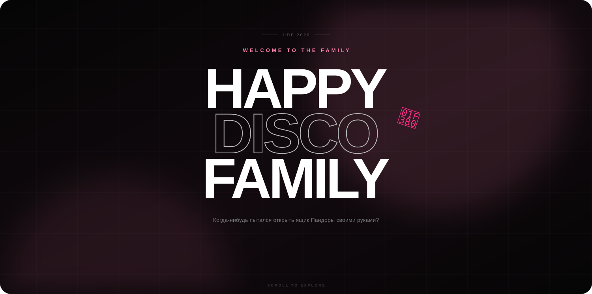

<h1 align="center">Официальный сайт HDF</h1>

Интерактивная веб-страница Discord-сообщества Happy Disco Family.

## О проекте

HDF — это ознакомительная брошюра, упрощающая адаптацию на нашем Discord-сервере для любого желающего вступить.

## Что мы имеем на данный момент

| Страница | Назначение |
| --- | --- |
| [`HDF`](index.html) | Главная страница с информацией о HDF и админ-составе |
| [`Dark.net/com^^`](archive.html) | Архив сайтов и список победителей розыгрышей |

## Лицензия

Код проекта распространяется по лицензии [MIT](LICENSE.txt).

Изображения, иконки, музыка и внешние материалы могут иметь отдельные права использования.

